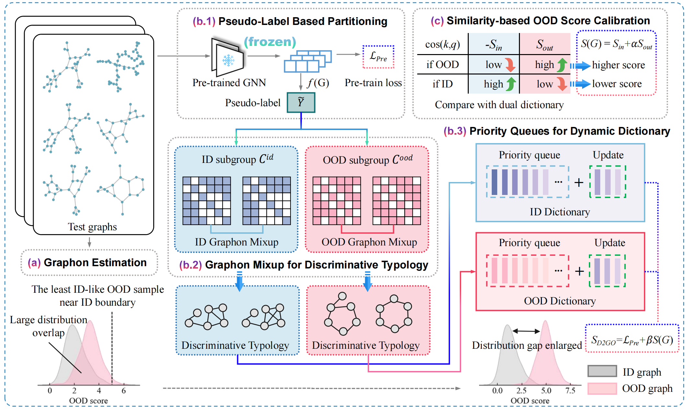

# [MM 2025] Test-time Graph OOD Detection via Dynamic Dictionary Expansion and OOD Score Calibration
This repository is the official implementation of "[Test-time Graph OOD Detection via Dynamic Dictionary Expansion and OOD Score Calibration](https://dl.acm.org/doi/abs/10.1145/3746027.3755741)" accepted by the 33rd ACM International Conference on Multimedia (MM-2025).

[](https://dl.acm.org/doi/abs/10.1145/3746027.3755741)

------

## 0. Abstract
Out-of-distribution (OOD) detection for graph-structured data remains a challenging problem, particularly when test-time OOD samples deviate significantly from the training outliers. Existing methods are typically optimized to capture the features within the in-distribution (ID) training data, but often fail to model the transitional region near the boundary between ID and OOD samples. Moreover, since data distributions are usually governed by multiple latent factors, pre-trained models constrained by the scope and diversity of training data struggle to represent the full spectrum of sample characteristics and distributional boundaries. To address this dilemma, we propose a novel test-time graph OOD detection method, termed D2GO, that constructs and dynamically updates ID and OOD graphon dictionaries for OOD score calibration, without requiring fine-tuning. Specifically, D2GO estimates graphons from test graphs and employs a mix-up strategy to generate boundary samples, eliminating the need for exposing auxiliary datasets or training graphs. Priority queues are utilized to expand the ID and OOD dictionaries by incorporating diverse graphons based on pseudo-labels at test-time, and the OOD scores are calibrated by computing the similarity between test samples and both graphon dictionaries. Extensive experiments on real-world datasets show that D2GO significantly outperforms existing state-of-the-art methods in OOD detection.


## 1. Requirements

Main package requirements:

- `CUDA == 11.1`
- `Python == 3.7.12`
- `PyTorch == 1.8.0`
- `PyTorch-Geometric == 2.0.0`

To install the complete requiring packages, use the following command at the root directory of the repository:

```setup
pip install -r requirements.txt
```

## 2. Quick Start
Just run the script corresponding to the experiment and dataset you want. For instance:

* Run out-of-distribution detection on all dataset pairs:
```bash
bash run.sh
```


## 3. Citation
If you find this repository helpful, please consider citing the following paper. We welcome any discussions with [hou_yue@buaa.edu.cn](mailto:hou_yue@buaa.edu.cn).

```bibtex
inproceedings{hou2025test,
  title={Test-time Graph OOD Detection via Dynamic Dictionary Expansion and OOD Score Calibration},
  author={Hou, Yue and Su, Yingke and Wu, Junran and Xu, Ke},
  booktitle={Proceedings of the 33rd ACM International Conference on Multimedia},
  pages={8845--8853},
  year={2025}
}
```
